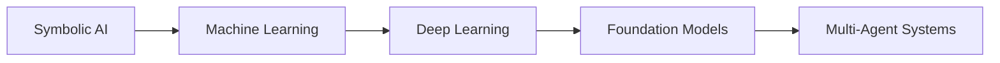

# Chapter 1: Introduction to AI

> **Learning Objective**: Understand the evolution, core concepts, and current landscape of Artificial Intelligence.

---

## 1.1 What is AI?

Artificial Intelligence (AI) is the field of computer science dedicated to creating systems capable of performing tasks that normally require human intelligence. These tasks include:

- **Perception**: Understanding images, speech, and sensory input
- **Reasoning**: Drawing logical conclusions from available information
- **Learning**: Improving performance through experience and data
- **Natural Language**: Understanding and generating human language
- **Planning**: Devising sequences of actions to achieve goals

### Key Insight
> AI is not about replicating human consciousness — it's about building systems that exhibit intelligent behavior in specific domains.

---

## 1.2 The Evolution of AI

### First Wave: Symbolic AI (1950s-1980s)
- Rule-based expert systems
- Logic programming (Prolog, LISP)
- Knowledge representation and reasoning
- **Limitation**: Couldn't handle uncertainty or learn from data

### Second Wave: Machine Learning (1990s-2010s)
- Statistical models learn patterns from data
- Supervised, unsupervised, and reinforcement learning
- Deep Learning breakthrough (ImageNet 2012)
- **Limitation**: Required large labeled datasets, narrow task specialization

### Third Wave: Foundation Models (2020s-present)
- Pre-trained on massive unlabeled corpora
- Transfer learning via fine-tuning
- Emergent capabilities: reasoning, coding, creativity
- **Current frontier**: Multi-modal, multi-agent, autonomous systems



---

## 1.3 Core AI Concepts

### Machine Learning Paradigms

| Type | Description | Example |
|:-----|:------------|:--------|
| **Supervised** | Learn from labeled data | Spam detection, image classification |
| **Unsupervised** | Find patterns in unlabeled data | Clustering, dimensionality reduction |
| **Reinforcement** | Learn through trial and error | Game playing, robot navigation |
| **Self-Supervised** | Generate labels from data structure | Language model pre-training |

### Neural Networks
- **Neurons**: Mathematical units that compute weighted sums
- **Layers**: Stacks of neurons processing information hierarchically
- **Activation**: Non-linear functions (ReLU, sigmoid) enabling complex representations
- **Training**: Backpropagation + gradient descent to minimize loss

### The Transformer Revolution
Introduced in "Attention Is All You Need" (Vaswani et al., 2017):
- **Self-Attention**: Each token attends to all other tokens
- **Parallelization**: No sequential recurrence like RNNs
- **Scalability**: Enables training on trillion-token corpora

---

## 1.4 The AI Landscape Today

### Major Players

| Company | Key Models | Focus |
|:--------|:-----------|:------|
| OpenAI | GPT-4, o1 | General intelligence, reasoning |
| Google | Gemini | Multi-modal, search integration |
| Anthropic | Claude | Safety, alignment, long context |
| Meta | Llama | Open-source, research |
| 科大讯飞 | Spark | Chinese language, education |

### Key Trends
1. **Multi-modality**: Text + image + audio + video understanding
2. **Agentic AI**: Autonomous task completion with tool use
3. **Small Models**: Efficient models for edge/on-device deployment
4. **Alignment**: Ensuring AI systems behave according to human values
5. **Regulation**: Global AI governance frameworks emerging

---

## 1.5 Why Multi-Agent Systems?

Single AI models have fundamental limitations:
- **Context Window**: Cannot hold all relevant information
- **Hallucination**: Generate plausible but incorrect information
- **Single Perspective**: One model = one reasoning pathway

Multi-agent systems overcome these by:
- **Specialization**: Each agent masters a narrow domain
- **Collaboration**: Agents cross-validate and complement each other
- **Scalability**: Add agents without retraining existing ones
- **Robustness**: Failure of one agent doesn't crash the system

```
Single LLM:                    Multi-Agent System:
┌─────────┐            ┌──────┐  ┌──────┐  ┌──────┐
│  One    │            │Profile│  │Planner│  │Content│
│  Giant  │    vs      └──┬───┘  └──┬───┘  └──┬───┘
│  Model  │              │         │         │
└─────────┘         ┌────┴─────────┴─────────┴────┐
                    │     EventBus + Memory         │
                    └──────────────────────────────┘
```

---

## Chapter 1 Exercises

1. Compare and contrast Symbolic AI with modern Foundation Models
2. Explain why the Transformer architecture was a breakthrough
3. List three advantages of multi-agent systems over monolithic models
4. Research: Find one real-world multi-agent application and describe its architecture

---

## Key Terms

- **Artificial Intelligence (AI)** · **Machine Learning (ML)** · **Deep Learning**
- **Neural Network** · **Transformer** · **Self-Attention**
- **Foundation Model** · **Multi-Agent System** · **Emergent Capability**
- **Supervised Learning** · **Reinforcement Learning** · **Transfer Learning**

---

## Further Reading

- Russell & Norvig, *Artificial Intelligence: A Modern Approach* (4th Edition)
- Vaswani et al., "Attention Is All You Need" (2017)
- Bommasani et al., "On the Opportunities and Risks of Foundation Models" (2021)
