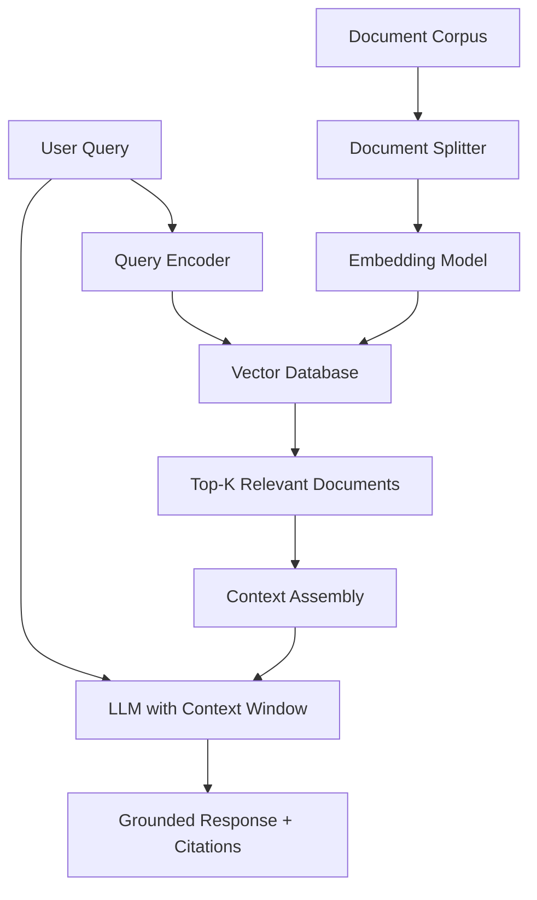

# Chapter 4: RAG Systems

> **Learning Objective**: Build Retrieval-Augmented Generation systems that ground LLM outputs in external knowledge.

---

## 4.1 The Hallucination Problem

LLMs generate text by predicting the most probable next token — not by consulting a knowledge base. This leads to:

- **Fabricated Facts**: Generating convincing but incorrect information
- **Outdated Knowledge**: Training data cutoff means missing recent events
- **Source Amnesia**: Cannot cite where information came from
- **Domain Gaps**: Poor performance on specialized/niche topics

### Why Not Just Fine-tune?

| Approach | Pros | Cons |
|:---------|:-----|:-----|
| Fine-tuning | Domain-specific knowledge baked in | Expensive, static, risks catastrophic forgetting |
| RAG | Always current, easier to update, transparent | Adds latency, requires retrieval infrastructure |

**RAG is the pragmatic solution for knowledge-grounded applications.**

---

## 4.2 RAG Architecture



### Two-Phase Pipeline

#### Phase 1: Indexing (Offline)
1. **Document Loading**: PDF, Markdown, HTML, DB records
2. **Text Splitting**: Chunk documents into manageable pieces
3. **Embedding**: Convert chunks to dense vectors (e.g., 1536-dim)
4. **Storage**: Store in vector database (ChromaDB, Pinecone, Milvus)

#### Phase 2: Retrieval + Generation (Online)
1. **Query Embedding**: Convert user query to vector
2. **Similarity Search**: Find top-K most similar chunks
3. **Context Assembly**: Combine chunks into prompt context
4. **LLM Generation**: Generate answer with retrieved context

---

## 4.3 Key Components

### Text Splitting Strategies

| Strategy | Best For | Example |
|:---------|:---------|:--------|
| **Fixed-size** | Simple documents | Split every 512 tokens |
| **Recursive** | General purpose | Split by paragraph → sentence → word |
| **Semantic** | Complex documents | Split at topic boundaries |
| **Code-aware** | Code repositories | Split by function/class/method |

### Embedding Models

| Model | Dimensions | Language | Max Tokens |
|:------|:-----------|:---------|:-----------|
| OpenAI text-embedding-3-small | 1536 | Multilingual | 8191 |
| OpenAI text-embedding-3-large | 3072 | Multilingual | 8191 |
| Cohere embed-v3 | 1024 | Multilingual | 512 |
| BGE-M3 (BAAI) | 1024 | Multilingual | 8192 |

### Vector Databases

| Database | Type | Key Feature |
|:---------|:-----|:------------|
| **ChromaDB** | Embedded | Zero-config, Python-native, great for prototypes |
| **Pinecone** | Cloud | Managed, serverless, high availability |
| **Milvus** | Self-hosted | Billion-scale, GPU acceleration |
| **Weaviate** | Hybrid | GraphQL API, hybrid search (vector + keyword) |
| **Qdrant** | Rust-based | High performance, filtering, quantization |

---

## 4.4 Advanced RAG Patterns

### Naive RAG → Advanced RAG

| Pattern | Description | When to Use |
|:--------|:------------|:------------|
| **Naive RAG** | Retrieve → Generate | Simple Q&A |
| **HyDE** | Generate hypothetical answer → retrieve similar | Ambiguous queries |
| **Parent Document** | Retrieve small chunks, return larger context | Need surrounding context |
| **Multi-Query** | Generate multiple query variants → merge results | Complex questions |
| **Self-Query** | LLM extracts metadata filters from query | Structured data |
| **Re-ranking** | Retrieve more, then re-rank with cross-encoder | Quality over speed |
| **Agentic RAG** | Agent decides: retrieve, reason, retrieve more | Multi-step research |

### RAG Evaluation Metrics

| Metric | What it Measures |
|:-------|:-----------------|
| **Faithfulness** | Is the answer supported by retrieved documents? |
| **Answer Relevance** | Does the answer address the question? |
| **Context Precision** | Are retrieved documents relevant? |
| **Context Recall** | Are all relevant documents retrieved? |

---

## 4.5 RAG in A3

The A3 system uses RAG principles in its anti-hallucination pipeline:

### Knowledge Grounding Flow

```
ContentAgent generates text
        │
        ▼
ReviewGate examines output
        │
        ▼
Against Knowledge Base (chapters/*.md)
        │
        ▼
Confidence Score assigned
        │
        ▼
Below threshold → flagged for revision
```

### Implementation Note

The Memory system (`src/memory/experience_memory.py`) has an API designed for future Vector DB migration:
- Current: JSON-based keyword matching
- Target: Vector similarity search (ChromaDB/Qdrant)
- Interface compatibility preserved

---

## Chapter 4 Exercises

1. Implement a text splitter that respects sentence boundaries for Chinese text
2. Compare cosine similarity vs. dot product for document retrieval — which is better when?
3. Build a minimal RAG pipeline: load 5 documents, retrieve top-3 for a query, generate answer
4. Evaluate your RAG: measure faithfulness and relevance for 10 test queries

---

## Key Terms

- **RAG (Retrieval-Augmented Generation)** · **Embedding** · **Vector Database**
- **Chunking** · **Similarity Search** · **Cosine Similarity**
- **HyDE** · **Re-ranking** · **Faithfulness**
- **Knowledge Grounding** · **Context Window** · **Source Attribution**

---

## Code Lab: Minimal RAG

```python
import numpy as np
from typing import List, Tuple

def cosine_similarity(a: np.ndarray, b: np.ndarray) -> float:
    return np.dot(a, b) / (np.linalg.norm(a) * np.linalg.norm(b))

class MiniRAG:
    def __init__(self, embedding_dim: int = 128):
        self.documents: List[str] = []
        self.embeddings: List[np.ndarray] = []

    def add_document(self, text: str, embedding: np.ndarray):
        self.documents.append(text)
        self.embeddings.append(embedding)

    def retrieve(self, query_embedding: np.ndarray, k: int = 3) -> List[Tuple[str, float]]:
        scores = [cosine_similarity(query_embedding, emb) for emb in self.embeddings]
        top_k_indices = np.argsort(scores)[-k:][::-1]
        return [(self.documents[i], scores[i]) for i in top_k_indices]

# Demo
rag = MiniRAG()
rag.add_document("Python is a programming language.", np.random.randn(128))
rag.add_document("Java is used for enterprise applications.", np.random.randn(128))
rag.add_document("Python has great ML libraries like PyTorch.", np.random.randn(128))

results = rag.retrieve(np.random.randn(128), k=2)
for doc, score in results:
    print(f"[{score:.3f}] {doc}")
```

---

## Further Reading

- Lewis et al., "Retrieval-Augmented Generation for Knowledge-Intensive NLP Tasks" (2020)
- Gao et al., "Retrieval-Augmented Generation for Large Language Models: A Survey" (2023)
- LangChain RAG documentation
- ChromaDB: https://www.trychroma.com/
